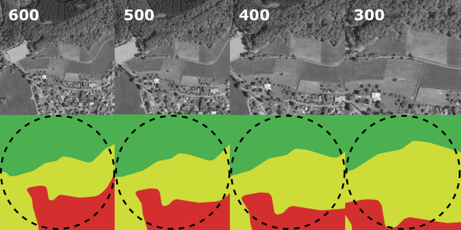

# Semantic clustering

Scripts for learning (semantic) clusters used within experiments of the IROS 2024 submission *Semantic Clustering of Image Retrieval Databases used for Visual Localization*. The repository uses distributions semantic segmentation masks of (aerial) images to cluster them for VPR.

## Usage

### Computing semantic clusters

    

For computing semantic clusters, *compute_clusters.py* may be used. Sample data has been provided in *sample_data/sem_val_db.json*, where each vector describes the distribution for the classes *(city, water, agriculture, forest)* for the position *x_y*. The FOV used for this relates to the camera used in our measurement campaigns and the respective height level. The following call computes the semantic clusters based on the sample data:

``
python3 compute_clusters.py --input_file sample_data/sem_val_db.json --type sem
``

The script further gives the option to calculate a data-driven clustering of VPR descriptors, extracted from NetVLAD, for instance. Results are stored in form of pickle files, i.e. the trained models are stored.

### Assigning queries to clusters

After learning the semantic clusters, *assign_clusters.py* can be used to soft-assign queries based on their semantic distributions to the learned clusters. The results are normalized, and can be used as input for the different strategies within the VPR evaluation in the [pytorch-NetVlad](https://github.com/hlzmnhnry/pytorch-NetVlad) repository. The following call uses the distributions of the segmentation masks, resulting from infering the captured camera images, and assigns them to the clusters:

``
python3 assign_clusters.py --input_file sample_data/sem_val_query_inf.json --type sem
``